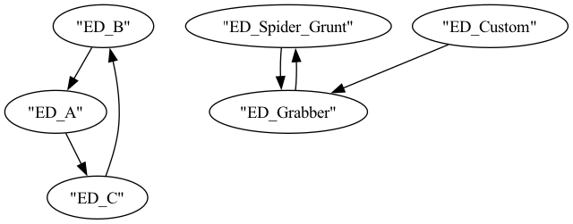

# CDLint


A linter for Custom Difficulty JSON files. Scans a Custom Difficulty JSON to
check for potential problems, such as referencing undefined Enemy Descriptors.
It should help Custom Difficulty makers to detect issues outside the game.

## Usage

Open your shell (e.g. PowerShell) and run the executable, providing the path
to the Custom Difficulty JSON file you wish to lint:

```bash
& "path\to\cdlint.exe" "path\to\cd.json"
```

### Configuration File

By default, CDLint will generate a `config.toml` configuration file next to
the executable. You can specify e.g. which custom
Enemy Descriptors you have added via modding (e.g. added by MEV).

### Consuming `cyclic_enemy_descriptor_references.dot`

The `cyclic_enemy_descriptor_references` lint can generate
`cyclic_enemy_descriptor_references.dot` next to the executable
if `generate_cyclic_reference_graph` is `true` in `config.toml`

This `.dot` file can be fed to [graphviz](https://graphviz.org/download/)
to be rendered into PNG/SVG/etc.:

```bash
dot -Tpng cyclic_enemy_descriptor_references.dot -o cyclic_enemy_descriptor_references.png
```

which will produce a graph like:



## Versioning

This repo uses virtual workspace and uses unified versioning for all constituent packages. Its
library packages are not intended for consumption by other crates. This repo does not strictly
adhere to semver and may change version numbers liberally.
