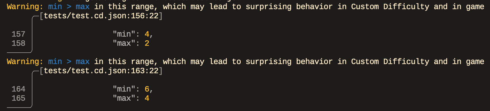

# CDLint



A linter for Custom Difficulty JSON files. Scans a Custom Difficulty JSON to
check for potential problems, such as referencing undefined Enemy Descriptors.
It should help Custom Difficulty makers to detect issues outside the game.

## Usage

Open your shell (e.g. PowerShell) and run the executable, providing the path
to the Custom Difficulty JSON file you wish to lint:

```bash
& "path\to\cdlint.exe" "path\to\cd.json"
```

### Configuration File

By default, CDLint will generate a `config.toml` configuration file in the
same directory as the CDLint executable. You can specify e.g. which custom
Enemy Descriptors you have added via modding (e.g. added by MEV).
